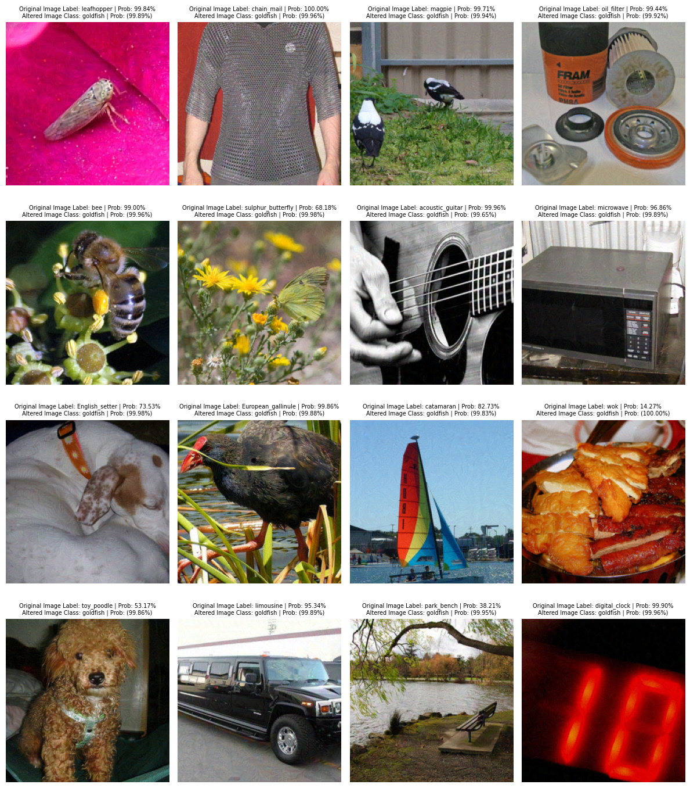
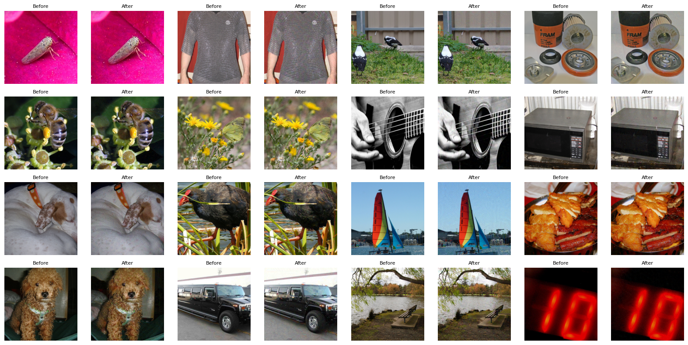

# Inverse CNNs - Adversarial Image Manipulation

A weekend project exploring adversarial attacks on convolutional neural networks using PyTorch. It demonstrates how to generate images that fool a pretrained ResNet-18 model into making incorrect predictions. I'm sure there's literature out there on how to do this better, though I can't say I've looked into it that much. Had this idea while swimming a couple days ago and wanted to give it a shot without looking into existing work.

## Overview

The notebook (`inverse_resnet.ipynb`) contains two main experiments:

1. **Inverse Image Generation**: Starting from random noise, optimize pixel values to generate images that the model classifies as a target class (goldfish).

2. **Adversarial Image Manipulation**: Take real ImageNet images and subtly modify them so the model misclassifies them as a different target class, while keeping the images visually similar to the originals.

## Results

### Adversarial Images with Predictions


### Before & After Comparison


## Setup

```bash
# Create virtual environment
python -m venv venv
source venv/bin/activate  # Linux/Mac
# or: venv\Scripts\activate  # Windows

# Install dependencies
pip install -r requirements.txt
```

## Usage

1. Download ImageNet sample images to `./imagenet-sample-images/`
2. Ensure `imagenet_class_idx.json` contains the ImageNet class labels
3. Run the Jupyter notebook:

```bash
jupyter notebook inverse_resnet.ipynb
```

## Requirements

- Python 3.10+
- PyTorch with CUDA support (optional, for GPU acceleration)
- See `requirements.txt` for full dependencies
